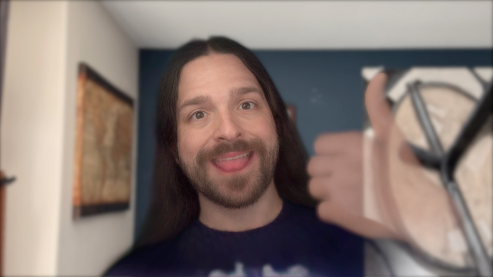

> If you're reading this, then my workflow for writing and publishing blog posts from Obsidian is working like a charm! And it even works from my phone, my iPad, and my Vision Pro!

If you're particularly observant, you might have noticed that there's a 6+ year gap between this post and the previous one. There are many reasons for this. Mostly excuses. But such excuses and justifications are of little interest in the grand scheme. The important thing is that I'm here now and I am to take this whole blogging thing a little more seriously this time around.

Well, *seriously* is a bit of a loaded word in this context. What I actually mean is this: 

- I aim to post much more frequently about the things that interest me and the things I'm working on.
- I don't aim to write perfectly-polished blog posts to bolster my own software engineering career. 
 
So I guess I'm taking this whole endeavor both more *and less* seriously. It's a paradox, but you should expect nothing less of me.

This shift should be evident in the refreshed style of this blog. Here's how it looked before

And here's how it looks now (redundant now, but this will capture it for posterity when I decide I'm tired of this theme)

The old format was presenting the typical "I'm a very experienced software engineer who writes thought-provoking pieces that go viral on Hacker News and I'm way too cool to be bothered with building a unique theme." The new theme[^1] better represents my interests and my background, but the content is the more important shift. 

I'm much more than a software engineer. I've a been a musician for nearly my whole life and had a lot of cool experiences in that domain despite never making any serious money in that pursuit. I love video games. I'm obsessed with Virtual Reality and XR. I love the new generation of thinkers like [Cal Newport]([https://calnewport.com](https://calnewport.com/)) who are forcing us to rethink our relationship with social media and technology in general.

I have a lot of thoughts and feelings about these topics and not enough outlets to share them and discuss them. And that's ultimately what I want this blog and this whole website to be about. I'm not here to sell you anything, to harvest your data, or shove AI slop down your throat. There's way too much of that in today's world. I'm much more interested in being a human on the internet again and laying all of my flaws and imperfections on the table for the world to see, for better or worse.

I could go on and on, but I think I’ve made my point clear by now. If you’re reading this and you’ve made it this far, I just want to say thanks for stopping by and I hope I can provide enough interesting ~~content~~ information to keep you coming back! You can use the RSS feed to keep up with new posts. I can’t yet point you to a way to leave feedback on this post or contact me, but I’ll work that out in the coming days. 

[^1]: Yes, it's vibe-coded. No, I won't apologize for it.
