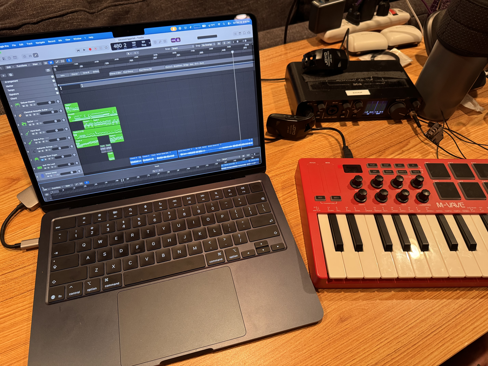

 ```site
 alt=A laptop, audio interface, and small musical keyboard on a desk
 caption=My humble mobile creation station. Still a work in progress
 ```

I spent most of my Saturday doing something I've been putting off for close to 20 years: curating my catalog of musical ideas.

By some miracle[^1] I have managed to keep almost all of the ideas I've ever captured in digital form. Today I finally went through as much of that old stuff as I could looking for gold. Most of it was just small snippets: a single guitar idea or a little groove. Several of these ideas have stayed at the top of my head ever since I first came up with them. I was surprised to find a number of well-developed ideas (several parts with different instruments and an initial arrangement) that I had completely forgotten about.

Once I finished cataloging everything I wanted to develop, I spent the rest of the afternoon and early evening developing one of those ideas that has continued to float back to the surface of my brain over the years. Most of my fullest-formed ideas were developed linearly: intro first, then the verse and chorus. From there I'd almost always get stuck.

I recently learned that most songs aren't actually written that way. So I revisited this idea by trying to come up with an ending and it was a lot easier than I expected! With an ending in place, the bits that led to it pretty much wrote themselves and I ended the session with a solid second half for this song I started almost 20 years ago. There's still some cleanup work to do in the arrangement, but this is the closest I've ever been to finishing a song that I've been carrying for that long and I couldn't be more stoked!

The most interesting thing about going through all of that old material was rediscovering how creative I used to be. A lot of the stuff was not very good and none of it was polished in any way, but I was having a lot of ideas at that time and I felt compelled to capture them. I still have a lot of ideas come into my head from somewhere, but somewhere along the way I lost the habit of capturing them and trying to do anything serious with them. I suspect my work as a software developer slowly erased this habit, but not for the reason you might expect.

AI has completely changed the software development game and my current company is embracing it full-bore. There is an element of fun to it. We're moving so much faster than we ever used to and delivering a lot more user value in shorter cycles. But in that change something was lost that I've only recently been able to identify: the struggle.

I never had a particularly strong affinity for writing code. I'm happy to let the machine do the work to which it is better suited, and I can't deny that Claude and Codex are much more capable at writing code than I ever was. But what I'm missing is the struggle against the blank page. It used to require intense effort and focus to turn the blank page into something the world found valuable. Now, filling any blank page is as easy as writing a prompt[^2].

On reflection, that struggle is exactly what I found so fulfilling in my work. I could look back at all of the code I wrote and take pride in its quality and the knowing that it provides joy to the users of it. Now, code is so cheap and easy to generate that the struggle is gone. Even worse: it's fundamentally changed how I view my old pre-AI work. Now anyone can trivially regenerate a better version of it in a fraction of the time and effort.

There is a huge silver-lining though: AI has caused me re-evaluate my personal priorities. It has forced me to reckon with the fact that it was never healthy to wrap up so much of my identity in my day job work. None of the work that I poured so much of myself into was ever *mine* in an ownership sense. Now I'm forced to find an outlet for all of the creative energy that is left over, and the answer has been waiting for me in my NAS for almost 20 years.

I regret not having this realization sooner, but you know what they say about hindsight. I can't make up for lost time, but I can stop being so anxious over it.

[^1]: I credit my first real developer job for teaching me about Network Attached Storage and cloud backup. Without that I probably would have lost all of my old portfolio to bit-rot years ago.

[^2]: Of course an agent prompt is a different kind of a blank page and I think this where experienced software engineers are still valuable. Ultimately, writing the code was never the hardest thing for most line-of-business apps.
