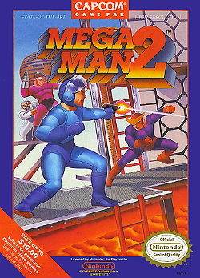

I been a video gamer for most of my life, ever since my Dad introduced a Nintendo Entertainment System into our household when I was 5 or 6 years old. These days I mostly play modern games in PC, but the retro era of NES and SNES still have a soft spot in my heart. The music from these games sticks with me to this day. One particularly outstanding soundtrack from that era is **Mega Man 2**.


```site
caption=When they were still figuring out how to sell Japanese games to us ignorant Americans
alt=Box art for the original Mega Man 2 game for the NES
```

For some reason I still can’t fathom, this game found its way into not only my household’s possession, but also into that of most of my childhood friends. I can’t pinpoint a specific memory of playing it with anyone but myself, but the music in this game stuck with me over the years. 

When I picked up the guitar in high school and started digging deeper into video game music, this is one of the games I came back to. I remember being struck by the idea that these songs would sound great recorded with real instruments. I couldn’t pull this off at the time but it was fun to get some of the melodies under my fingers.

Fast forward some years later and I stumble upon this video of a band called **Bit Brigade** actually playing Mega Man 2 with live guitars and drums! They also have a gamer onstage with them speed running the game projected behind them. So they aren’t just playing the music: they’re providing the soundtrack for the game in real-time!

https://www.youtube.com/watch?v=MUHlVdqRlPA
```
title=Bit Brigade performing Mega Man 2 at MAGFest X 14 years ago
```

I haven’t followed their career too closely, but apparently they’ve been successful enough over the last decade to tour around the country doing their thing with different games. And this last Monday saw them bring Castlevania and, of course, Mega Man 2 to my hometown.

https://youtu.be/rMKPfaqQ7ZE
```
title=# Bit Brigade: Megaman 2 Theme (Wave, Wichita KS, Sept 28 2026)
caption=Sorry for the shit audio. I think it's because I had my camera mic default to Voice Isolation mode during video recording ☠️ 
```

The show was loud and fast. I’ve not actually played Castlevania but their gamer got through the game with expert finesse in what felt like less than 20 minutes. Then they did a crowd participation segment by inviting a member of the crowd to challenge their gamer in a game of Tetris. It was best of 5 and the crowd member managed to get one win, but ultimately succumbed to the gamer’s skill.

Then finally came Mega Man 2 and it was epic! The highlights for me were the intro, Air Man, Bubble Man (only for the insane bass part) and of course Wily’s Castle 1 [^1].

Some may think that putting all this energy into video music is a silly endeavor, but I challenge you to give it a chance. With the right instrumentation I think anything from the Mega Man 2 soundtrack compares well to other popular rock and metal bands of the time. And there is some real musicianship required to do this music justice. It’s even more impressive when you consider that this music wasn’t written with the guitar in mind.

Most importantly, Bit Brigade brings a real crowd. They had a great turnout for a Monday night in a city they’d never played before. And their festival crowds demonstrate that there is a real audience for live video game music. In an era where music is overwhelmed with over-edited social media content and AI slop, I think people are desperate for something that is real and reminds them of the better times. I’ve had a private theory that performing video game music live could find this audience and Bit Brigade are direct evidence supporting that theory.

[^1]: This song was my dedicated PagerDuty ringtone for a few months so I have some mild PTSD associated with this song. In spite of that I still love it!
